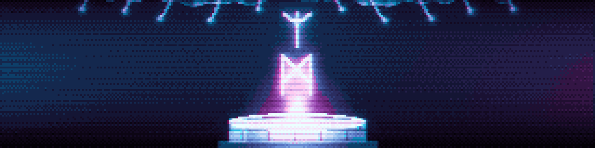
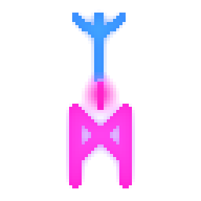

<picture>
  <source media="(prefers-color-scheme: dark)"  srcset="assets/banner_1280x320.png">
  <source media="(prefers-color-scheme: light)" srcset="assets/banner_light_1280x320.png">
  
</picture>

# Mimir

**English** · [简体中文](README.zh-CN.md)

**A learning vault that teaches.** It is an [Obsidian](https://obsidian.md) vault and a [DeepSeek Harness](https://github.com/deepseek-ai/deepseek-harness) agent preset, wired together so that the agent is a teacher rather than a chatbot: it probes what you already understand, plans a dependency map of the subject, waits for your approval, then builds the topic one node at a time and writes everything into the vault as it goes.

Named for Mímir's well, the well of wisdom under Yggdrasil. What you are looking at is the well; the vault is where the water goes.


---

<picture>
  <source media="(prefers-color-scheme: dark)"  srcset="assets/divider_1280.png">
  <source media="(prefers-color-scheme: light)" srcset="assets/divider_light_1280.png">
  
</picture>

## The problem it is built for

Reading about something and understanding it are different states, and only one of them survives a month. A pile of disconnected facts rots; facts held in place by their connections do not, because each one stays recoverable from the others.

So the goal here is not coverage. It is the moment a pile of loose facts collapses into two or three generating ideas, and stays collapsed.

Two principles do the work, and the rest of the system is downstream of them:

1. **Unconditional truths first.** Start from the few things you can accept as-is, with no caveats. Not because bottom-up is tidier, but because caveat-free facts are the only ones the mind will commit to without hedging. Where no exception-free truth exists at the level you are working at, the honest move is to say so and drop to the next solid ground: a definition, a distinction, a constraint.
2. **"How could I have discovered this?"** A fact with no visible reason to be the way it is feels arbitrary, and arbitrary facts do not stick. So every step is motivated from the problem that sent someone down that path. Nothing appears from nowhere.

The method is a port of [amosblomqvist/learn](https://github.com/amosblomqvist/learn), rebuilt for DSH: the reference system's graded-quiz extension becomes a real selectable-question tool, its researcher and diagram steps become preset sub-agents, and its markdown log becomes an actual vault.

## What you get

| | |
| --- | --- |
| **The preset** | `Mimir Tutor` — nine method skills, six specialist sub-agents, and the standing rules about verifying facts before asserting them. This is the teacher. |
| **The vault** | A working Obsidian vault: session, concept and map templates, a spaced-review queue, generated SVG dependency maps, a glossary that grows only from words a lesson actually needed, and a reading list capped at two books a session. |
| **The Lesson pane** | A docked tab in the DSH interface carrying the question, the vault's drawings, the lesson spine and a scratch page, so the reading column keeps its full height. |
| **The theme** | `Mimir` — warm paper, sage, a serif for what is read and a monospace for what is furniture. |
| **Three plugins** | Reading-size and light/dark controls, a startup animation, and a publisher that copies a finished note and its diagrams into a second library vault. |

## Install

You need [Obsidian](https://obsidian.md) and [DeepSeek Harness](https://github.com/deepseek-ai/deepseek-harness). The desktop build of DSH is the easiest route.

```sh
git clone https://github.com/tommyhedgerow/Mimir.git
cd Mimir
./scripts/install.sh
```

Or import just the teacher, without cloning anything: **[Mimir Tutor on Preset Square](https://dshdesktop.com/preset/p/mimir-tutor-20d96e)** is the same preset as a single `.dshpreset` file, which DSH Desktop installs from Settings → Agent presets → Import. That route gives you the teacher; the vault, the theme and the plugins come from the clone.

The installer copies the preset into your DSH home and registers the Lesson pane as a profile bundle. It backs up anything it replaces rather than overwriting it.

Then:

1. **Restart DSH Desktop.** A preset is composed once per process, so the new one is not visible until the app comes back up.
2. **Open the `Mimir` folder as the workspace** in DSH, and pick **Mimir Tutor** in the session picker.
3. **Open the same folder as a vault in Obsidian.**
4. **Say what you want to learn.** "Teach me plate tectonics." "I want to understand what Kant actually did." "Explain mycorrhiza."

`./scripts/install.sh --dry-run` shows what it would do without touching anything. `--no-pane` skips the Lesson pane if you only want the preset. `./scripts/uninstall.sh` reverses it.

Fuller detail, including the manual path and how to build a `.dshpreset` to share, is in **[INSTALL.md](INSTALL.md)**.

<picture>
  <source media="(prefers-color-scheme: dark)"  srcset="assets/mark_well_256.png">
  <source media="(prefers-color-scheme: light)" srcset="assets/mark_well_light_256.png">
  
</picture>

## How a session actually goes

**Probe.** The teacher asks a bracketed set of questions: something at the level you should get right, and something you should get wrong. The truth is in between. An all-correct run means the questions were too easy, so it escalates. One miss is one coordinate, not a verdict: it probes around the miss to find out whether it is a slip, a gap, or a misconception, because a misconception has to be dislodged rather than topped up.

**Plan.** A cartographer sub-agent maps the field first, so the plan is not built on a half-remembered version of the subject. What comes back is prose plus a small dependency map, roots at the top and your goal at the bottom. **Then it waits.** That map is your checkpoint, and it is also the teaching order.

**Teach.** One node at a time, and every node gets the same four moves: motivate it, establish it, connect it to what you already hold, and check it. A miss means stop and repair. Nothing is built on an unconfirmed node.

**Write it down.** Sessions, concepts, maps and review entries land in the vault as they happen, not reconstructed at the end. The diagrams are generated from the notes' own frontmatter by a script, so a picture of where you stand cannot quietly go stale.

**Review.** Taught concepts earn a due date. Retrieval first, repair on a miss, and the next interval set by how well it went. Four clean retrievals and the concept is retired off the queue.

## What is in the repository

```
Learn/              the vault
  How We Learn.md     the method, written for the learner rather than the machine
  Learner Profile.md  a blank form: your floors, your edges, your misconceptions
  Sessions/           one dated note per session, written live
  Concepts/           atomic notes, one idea each, wikilinked into a graph
  Maps/               one per strand, holding the dependency order and the frontier
  Reviews/            the spaced-review queue
  Glossary/           one note per niche word a lesson actually needed
  Templates/          Session, Concept, Map
  Viz/                generated SVG, drawn at the width of the reading column
  Dashboard.base      live views: what is due, what is fragile, where each strand stands

preset/             the DSH agent preset
  preset.yml          the name and description the session picker shows
  agent.cordis.yml    the persona, the tool rows, and the six specialists
  skills/             the nine method skills, one directory each
  lesson-pane/        the docked pane: host half and browser half

.obsidian/          the theme and the three plugins, ready to use
Tools/              the generators: vault-map, vault-chart, check-tokens, publish, sync-skills
assets/             the artwork in this README, and the startup animation
scripts/            install, uninstall, and preset packaging
```

<picture>
  <source media="(prefers-color-scheme: dark)"  srcset="assets/divider_1280.png">
  <source media="(prefers-color-scheme: light)" srcset="assets/divider_light_1280.png">
  
</picture>

<picture>
  <source media="(prefers-color-scheme: dark)"  srcset="assets/mark_rune_256.png">
  <source media="(prefers-color-scheme: light)" srcset="assets/mark_rune_light_256.png">
  
</picture>

## The six specialists

The teacher delegates to narrow roles rather than one general assistant, each with its own persona and a tool allow-list so it cannot wander.

| | |
| --- | --- |
| **Verifier** | A fast bounded fact-checker. Wikipedia is its instrument and it has a hard call budget, because an unbounded fact-check is how a lesson stalls for six minutes. Returns a verdict per claim, and corrects the question's premise when the premise is wrong. |
| **Cartographer** | Maps a topic's conceptual terrain before anything is planned: the genuine foundations, what depends on what, the classic traps, and where the field itself is unsettled. |
| **Diagram maker** | Turns one idea into one readable visual, mermaid or hand-written SVG. Cuts first: more than about seven nodes is usually a bad diagram. |
| **Examiner** | Designs the questions. Distractors are built by mutating the correct claim into the specific misconception it resembles, so the options are even by construction rather than by effort. |
| **Sophist** | The adversarial reader. Steelmans a claim, then attacks that version. Separates "this is false" from "this is contestable" from "this is a matter of definition". |
| **Librarian** | Keeps the shelf: extends an existing note before creating a near-duplicate, keeps the maps current, fixes wikilinks when anything moves, and files review entries. |

<picture>
  <source media="(prefers-color-scheme: dark)"  srcset="assets/mark_axis_256.png">
  <source media="(prefers-color-scheme: light)" srcset="assets/mark_axis_light_256.png">
  
</picture>

## The three plugins

All three are MIT and installable by hand from their own repositories, which carry the source, a release workflow and a README:

- **[Mimir Controls](https://github.com/tommyhedgerow/obsidian-mimir-controls)** — step the reading size and switch light or dark from the note header. Writes to exactly two of Obsidian's own settings and keeps no state of its own.
- **[Mimir Splash](https://github.com/tommyhedgerow/obsidian-mimir-splash)** — plays the pixel-art animation above, once, over the vault as it opens. Any key dismisses it.
- **[Lesson Publisher](https://github.com/tommyhedgerow/obsidian-lesson-publisher)** — publishes a finished note, and every file it embeds, into a second vault, mirroring the folder structure so wikilinks still resolve. Desktop only.

The theme is **[Mimir](https://github.com/tommyhedgerow/obsidian-mimir-theme)**.

<picture>
  <source media="(prefers-color-scheme: dark)"  srcset="assets/divider_1280.png">
  <source media="(prefers-color-scheme: light)" srcset="assets/divider_light_1280.png">
  
</picture>

## Requirements, and what it reaches for

- **Obsidian** 1.5 or later. The vault, the theme and the two reading plugins work on desktop and mobile; Lesson Publisher is desktop only because it writes outside the vault.
- **DeepSeek Harness**, with a model route configured. The preset composes against `@deepseek-ai/*` packages the harness already provides; it installs nothing and downloads nothing.
- **Web search** for the verifier. The preset grants `web_search` and `web_fetch` and nothing else to that role, and caps it at eight calls.
- **Node.js**, only for the vault's three generator scripts.

## Other things worth knowing

- **Nothing is loaded from the network by the theme.** No webfonts, no remote images: system fonts, local CSS. It works offline.
- **The Lesson pane is optional.** The preset works without it; you read the lesson in the vault instead of in a docked tab.
- **Everything is a plain file.** The preset is a directory you can read and edit, the skills are markdown, and the vault is markdown. Editing a skill takes effect on its next load; editing `agent.cordis.yml` needs a DSH restart, for the reason above.
- **It ships in Simplified Chinese too.** A second preset, `mimir-tutor-zh`, teaches in Chinese, and every document the learner reads has a Chinese twin beside it in the vault. `docs/zh-CN-glossary.md` records what is translated and what is deliberately left in English.

<picture>
  <source media="(prefers-color-scheme: dark)"  srcset="assets/badge_row_1280.png">
  <source media="(prefers-color-scheme: light)" srcset="assets/badge_row_light_1280.png">
  
</picture>

## Licence

MIT. See [LICENSE](LICENSE).
